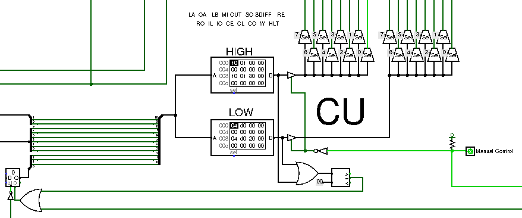

# 8-bit computer Simulator and Assembler

This project is inspired by Ben Eater 8-bit computer series. I simulated the circuit with the free software Logisim, using almost only discrete logic and memory.
To run code on the machine you need to write machine code (binary/hexadecimal) in ROM, that will be copied in RAM at startup. To simplify the process I created a simple assembler ([here](https://francesco-scar.github.io/8-bit_pc/Compiler/Web/Compiler.html) you can find the assembly web page) to convert code written with mnemonics codes to machine code. In the same page you can debug your code simulating the internal status of the computer step-by-step (memory and registers).

# Table of contents
- [General description](#general-description)
- [Components](#components)
  - [Clock](#clock)
  - [Register A](#register-a)
  - [Register B](#register-b)
  - [Arithmetic Logic Unit - ALU](#arithmetic-logic-unit---alu)
  - [Program Counter](#program-counter)
  - [Random Access Memory - RAM](#random-access-memory---ram)
  - [Boot Loader](#boot-loader)
  - [Flags](#flags)
    - [Zero Flag](#zero-flag)
    - [Carry Flag](#carry-flag)
  - [Control Unit - CU](#control-unit---cu)
    - [Input Data](#input-data)
    - [Output Data](#output-data)
  - [Output - Display Decoder](#output---display-decoder)
  - [Components statistics](#components-statistics)
- [Machine code instructions](#machine-code-instructions)
  - [Instructions format and arguments](#instructions-format-and-arguments)
  - [Instructions list](#instructions-list)
- [Assembler](#assembler)
  - [Graphical User Interface - GUI](#graphical-user-interface---gui)
  - [Mnemonics](#mnemonics)
- [Simulator](#simulator)

# General description


The computer is a simple 8-bit bus calculator, it can store a program in ROM that will be copied into RAM at startup. Then the code will be executed and the result will be shown on the display.
At the moment the computer doesn't have any input (in a normal use case, without manipulating internal state and signals), so it can only execute numerical operations and show the results.

# Components

## Clock


The main clock is generated from this Logisim clock block. The signal enter in a 3-input AND gate (the other two inputs are inverted), so the signal propagates only if the other two lines are both LOW. The upper line is manually controlled and enable the user to stop the clock (not very useful), whereas the bottom line is controlled by the [Control Unit](#control-unit---cu), so the program can HALT the machine (this line goes HIGH when the HALT command gets processed).


The display decoder has a separate clock, that the computer can't stop. In the real computer the two clocks would be completely independent from each other, but in Logisim this clock is actually in sync with the main clock. The display decoder design is explained in the [display](#output---display-decoder) section.

## Register A


The computer has two registers (A and B). Register A is the main register of the computer: it is directly connected with the [ALU](#arithmetic-logic-unit---alu), and to the main bus with controlled buffers (activated by the CU during normal use).

The register can output its value to the main bus, so the data can be used by other units, for example:
- Display buffer
- RAM
- Register B
- (Register A itself)

The input of the register is directly connected to the main bus, so it can load the value on the bus on the clock rising edge if and only if the LOAD signal is HIGH, so data from the other register, RAM or ALU can be stored in this register.

## Register B


Register B is a register of the computer: it's similar to the A register, but it's directly connected with the [ALU](#arithmetic-logic-unit---alu) and can't output its value to the main bus, so the data can't be used by other units except for the [ALU](#arithmetic-logic-unit---alu).

The input of the register is directly connected to the main bus, so it can load the value on the bus on the clock rising edge if and only if the LOAD signal is HIGH, so data from the other register, RAM or ALU can be stored in this register.

This register is essential to perform arithmetic operations, because to add or subtract two numbers its needed to load one number in register A and the other number in register B.

## Arithmetic Logic Unit - ALU
The ALU is the unit that performs arithmetic operations: in particular this unit can sum or subtract two 8 bit numbers.


The unit is composed of 8 adders that are able to sum three 1-bit numbers and output a 1-bit result and a 1-bit carry.


The units are connected in cascade, so the _i-th_ unit sums the _i-th_ bit of A register, the _i-th_ bit of B register and the carry of the previous unit. The carry input of first unit is connected to the DIFF signal to subtract B from A, as explained below.

To perform the subtraction A-B is sufficient to add A+(-B), where A and B are represented in two's complement.
The two's complement of a binary number can be calculated flipping each bit and then adding one; so if the DIFF signal is HIGH the XOR gates flip each bit (XORs act as controlled NOT gates) and then 1 is added as the "carry input" of the first adder unit (that input is actually connected to the DIFF signal so it's 1 when DIFF is HIGH and 0 when it is LOW). If the DIFF signal is LOW the unit act as a normal adder.

The result of the operation output can be shared on the main bun and therefore it can be stored in registers or used from other units (current [instruction set](#instructions-list) allow to store the result only in A register, but it can be expanded to include other uses).

The carry of the last adder unit and the result of the operation are used by the [flags](#flags) register.

## Program Counter


The program counter is a D-Flip-Flop that stores the current program instruction address.

It gets incremented by 1 during the second step of every instruction, and its value gets shared on the main bus during the first step of any instruction to allow the [RAM](#random-access-memory---ram) address register to store the address of the opcode that will be executed in the next cycles.

The jump and conditional jumps instructions change the value of this counter to the appropriate address to control the execution flow.

## Random Access Memory - RAM


The computer execute the code loaded in RAM starting from address 0 (zero). The RAM unit is made of two 256 byte RAM modules, one contain the instructions opcodes (HIGH RAM), and the other one contains the parameters of the instruction (LOW RAM).

During the first step of each instruction the RAM address buffer gets loaded with the current program counter value (using the main bus).

During the second step of each instruction the RAM cell corresponding to the current RAM address buffer value gets loaded into the Instruction Register and the Parameter Register.


The instruction register value is then used by the [Control Unit - CU](#control-unit---cu) to perform the operations corresponding to that opcode, whereas the parameter register value can be shared with other units (if needed) using the main bus.

HIGH RAM content (instructions opcodes) can't be shared on main bus, its output is connected only with the instruction register used by the [Control Unit - CU](#control-unit---cu).

## Boot Loader


The code need to be loaded in RAM to be executed, but manually load the program every time the computer gets powered on is quite boring. So the executable machine code can be stored in a persistent memory (ROM) and automatically loaded into RAM at startup.

This process is done by the bootloader circuit.

The unit is active until the output of the OR gate is HIGH, so the counter increment its value every cycle of the JK flip-flop, so every 2 cycles of the main clock.
For each counter value the corresponding address is stored into the RAM address buffer and, during the next clock cycle, the value of the ROM gets copied into the RAM. This two phases are regulated by the JK flip-flop, because its output controls the control lines of the [CU](#control-unit---cu).

To be able to manually control the computer internal signals the Manual Control signal is kept HIGH by the OR output.

When a ROM cell with 0xff value gets reached the comparator switches to LOW, so when the flip-flop output gets LOW too (at the end of the current cycle) the enable signal of the counter gets LOW and the Manual Control signal gets LOW as well, therefore the computer will start executing the loaded code from address 0x00 on the next clock cycle.

## Flags


The [CU](#control-unit---cu) operations are determined by the combination of the current loaded instruction opcode and the latched status of the Flag Register, so the same instruction might produce different behavior of the CU with different flag status (this trick is mostly used for conditional jump instructions).

### Zero Flag
The Zero signal gets HIGH if and only if the output of the [ALU](#arithmetic-logic-unit---alu) is zero and it's generated by a NOR gate that takes the output of the [ALU](#arithmetic-logic-unit---alu) as input, so the output is HIGH only if all the input bits are LOW.

This flag can be used to compare two numbers: if you need to compare an unknown number A with a known number B, you can subtract B from A (or vice versa), then you can check the zero flag, if it's HIGH the two numbers were equal.

The Flags register latches synchronously the zero signal if enabled by the [CU](#control-unit---cu); currently the register latches the value after arithmetic operations such as sums and subtractions.

### Carry Flag
The carry signal gets HIGH if and only if the carry bit of the last [ALU](#arithmetic-logic-unit---alu) unit is HIGH.

This happens when the sum of two numbers (stored in A and B registers) generates an overflow (the result can't be represented with 8 bit because it's greater then (2^8)-1) or if the difference of two numbers (A-B registers value) is a **positive** or **null number** number (so if A >= B).

This flag can be used to compare two numbers: if you need to compare an unknown number A with a known number B, you can subtract B from A, then you can check the carry flag, if it's HIGH then A >= B.

The Flags register latches synchronously the carry signal if enabled by the [CU](#control-unit---cu); currently the register latches the value after arithmetic operations such as sums and subtractions.

## Control Unit - CU


The control unit controls the signals of every other unit of the computer.

The Control Unit is made with a ROM memory that emulates a combinatorial circuit (to each input (address input) correspond a pre-programmed output (data output)), but it's easier to create and modify if needed. The computer has 16 control signals, so 2 8-bit output ROM are needed.

The ROM image is produced by the [CPU_ROM.py](CPU_ROM.py) program.

The address determine the operation that the CU will execute, in particular to each address correspond a specific state for each control signal, based on the data stored in the ROM cell.

**NOTE**: the CU changes the control signals during the falling edge of the clock, whereas the units load or output, or any operation in general, occur during the rising edge of the clock, this avoid propagation problems and race conditions.

### Input Data
The memory data is stored in such a way that the address bits have the following semantic meaning:
| Bits number/range | Related to |
|:-----------------:|------------|
| 10                | Zero Flag  |
| 9                 | Carry Flag |
| 3 - 8             | Opcode     |
| 0 - 2             | Step Number|

This division can be noticed in the image above: the lower 3 bits are taken from the step counter, the middle 6 bits are connected to the output of the instruction register (only the HIGH byte, where the opcode is stored) and the upper 2 bits are connected to the flag register.

##### Zero Flag bit
Most of the operations aren't influenced by the status of this bit, except for the JZF (Jump if Zero Flag) that execute a NOP instruction if the Zero Flag is 0 and execute a JMP (Jump) instruction if it's 1.

##### Carry Flag bit
Most of the operations aren't influenced by the status of this bit, except for the JCF (Jump if Carry Flag) that execute a NOP instruction if the Carry Flag is 0 and execute a JMP (Jump) instruction if it's 1.

##### Opcode
The binary value of the opcode that represent the desired instruction. This argument is discussed in detail in the [Machine code instructions](#machine-code-instructions) section.

##### Step Number
Each instruction has several consecutive steps.
The first two steps of each instruction are needed to allow the proper execution of the code.

During the first step:
- the program counter outputs its value to the main bus
- the RAM address register loads the main bus value

During the second step:
- the RAM gets enables
- the RAM outputs on the bus the value stored in the address specified by the RAM address register
- the instruction registers latch the bus value
- the program counter increments its value by one (so on the next first step the CU will execute the consecutive instruction, if the program doesn't change the flow with a jump)

### Output Data

The bit corresponding to each signal can be found in the [CPU_ROM.py](CPU_ROM.py) program.

```python:CPU_ROM.py [1-17]

```

For example to add immediately a value to the A register the CU needs two steps (in addition to the two default steps needed for every instruction).

In the first step:
- sets the Parameter Instruction register Output signal HIGH
- sets the B register Input signal HIGH
So the parameter will be loaded into B register through the main bus

In the second step:
- sets the [ALU](#arithmetic-logic-unit---alu) output signal HIGH
- sets the A register Input signal HIGH
- sets the Flag Register Input signal HIGH
So the output of the addition get stored in the A register through the main bus and the status of the flags gets latched into the Flag Status Register

## Output - Display Decoder
## Components statistics
# Machine code instructions
## Instructions format and arguments
## Instructions list
# Assembler
## Graphical User Interface - GUI
## Mnemonics
# Simulator
